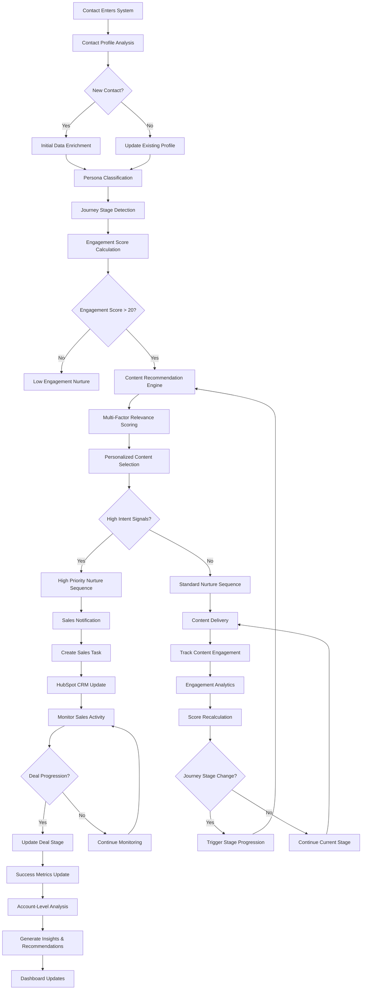

# ABM Content Marketing System - Workflow Flowchart
**Version: 08-09-2025 16:00:00**  
**Authored by: Sotiris Spyrou, CEO, VerityAI**  
**File Path: //documents/Workflow_Flowchart_08092025.md**

## System Architecture Flow Diagram



## Detailed Process Flow

### **Phase 1: Contact Identification & Enrichment**
```
1. Contact Entry → 2. Profile Analysis → 3. Data Enrichment → 4. Classification
```

**Key Decision Points:**
- New vs. existing contact handling
- Data completeness assessment
- Initial engagement threshold evaluation

**Automated Actions:**
- HubSpot property updates
- Initial persona assignment
- Baseline engagement score calculation

### **Phase 2: Intelligent Content Matching**
```
5. Journey Stage Detection → 6. Content Recommendation → 7. Relevance Scoring → 8. Personalization
```

**Scoring Algorithm Flow:**
```
Industry Match (25%) + Persona Fit (20%) + Stage Alignment (20%) + 
Engagement History (15%) + Content Freshness (10%) + Performance (10%) = Relevance Score
```

**Content Decision Matrix:**
- **Score 80-100**: Premium content + immediate sales notification
- **Score 60-79**: High-value content + standard nurture sequence  
- **Score 40-59**: Educational content + awareness nurture
- **Score 20-39**: Generic content + low-priority nurture
- **Score <20**: Re-engagement campaign

### **Phase 3: Automated Nurture Orchestration**
```
9. Sequence Selection → 10. Trigger Evaluation → 11. Action Execution → 12. Performance Monitoring
```

**Sequence Types:**
1. **Awareness Nurture**: Educational content → Industry insights → Problem identification
2. **Consideration Nurture**: Solution guides → Comparison content → ROI calculators  
3. **Decision Nurture**: Case studies → Demos → Reference calls
4. **High-Intent Acceleration**: Immediate sales engagement + premium content
5. **Re-engagement**: Alternative formats + value reminders

### **Phase 4: Sales-Marketing Alignment**
```
13. Sales Signal Detection → 14. Task Creation → 15. CRM Synchronization → 16. Pipeline Tracking
```

**Sales Trigger Conditions:**
- Engagement score increase >30 points
- High-intent content consumption (demo, pricing)
- Multiple stakeholder engagement
- Journey stage progression to evaluation/decision

**Automated Sales Actions:**
- High-priority task creation
- Contact context provision
- Recommended next actions
- Competitive intelligence alerts

### **Phase 5: Analytics & Optimization**
```
17. Data Collection → 18. Performance Analysis → 19. Insight Generation → 20. Optimization Recommendations
```

**Key Metrics Tracking:**
- **Leading Indicators**: Engagement velocity, content consumption, stakeholder multiplication
- **Lagging Indicators**: Pipeline generation, deal acceleration, win rate improvement

**Optimization Feedback Loops:**
- Content performance → Recommendation algorithm updates
- Sequence effectiveness → Trigger condition refinement  
- Sales feedback → Scoring weight adjustments
- Account analysis → Persona model improvements

## Integration Architecture

### **Data Flow Diagram**
```
External Data Sources → HubSpot CRM → ABM Engine → Analytics Dashboard
     ↓                       ↓              ↓             ↓
Content Management → Recommendation → Nurture Engine → Reporting
     ↓                       ↓              ↓             ↓
Email Platform ← Content Delivery ← Sales Tasks ← Performance Metrics
```

### **API Integration Points**
1. **HubSpot CRM API**: Contact/company data, properties, workflows
2. **Google Analytics**: Website behavior, content consumption  
3. **Email Platform**: Delivery tracking, engagement metrics
4. **Content Management**: Asset library, performance data
5. **Calendar Systems**: Meeting scheduling, sales activity tracking

## Error Handling & Failsafes

### **Critical Failure Points & Responses**
```
API Rate Limits → Exponential Backoff + Queue Management
Data Quality Issues → Validation + Manual Review Flags  
Content Gaps → Fallback to Generic High-Performing Content
Sequence Failures → Skip to Next Action + Error Logging
Integration Errors → Graceful Degradation + Administrator Alerts
```

### **Data Quality Monitoring**
- **Real-time Validation**: Required fields, format checks, range validation
- **Periodic Audits**: Data completeness, accuracy, freshness
- **Anomaly Detection**: Unusual patterns, engagement spikes/drops
- **Manual Review Triggers**: Low confidence scores, conflicting signals

## Performance Benchmarks

### **System Performance Targets**
- **Response Time**: <2 seconds for real-time recommendations
- **Data Sync Latency**: <5 minutes for HubSpot updates
- **Batch Processing**: <30 minutes for daily analytics refresh
- **Uptime Target**: 99.5% availability during business hours

### **Business Performance KPIs**
- **Content-to-Meeting Conversion**: Target 15% (Baseline: 8%)
- **Sales Cycle Reduction**: Target 30% decrease
- **Account Engagement Breadth**: Target 70% stakeholder coverage
- **Pipeline Velocity**: Target 25% increase in stage progression speed

## Scalability Considerations

### **Current Capacity (MVP)**
- **Accounts**: 100 enterprise accounts
- **Contacts**: 1,000 individual contacts
- **Content Items**: 500 pieces in library
- **Daily Events**: 10,000 engagement events

### **Scaling Architecture (Phase 2)**
- **Horizontal Scaling**: Multiple processor instances
- **Data Partitioning**: Account-based data distribution
- **Caching Layer**: Redis for real-time recommendations  
- **Queue Management**: Event-driven processing with backpressure handling

This workflow provides complete visibility into the ABM system operations, enabling effective monitoring, troubleshooting, and optimization throughout the implementation lifecycle.
